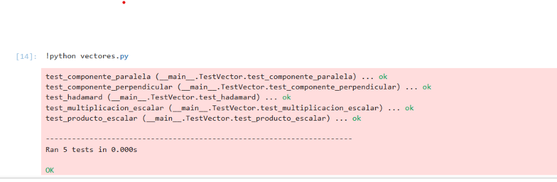

# Tercera tarea APA: Multiplicación de vectores y ortogonalidad

## Autor

Pablo Pérez

---

## Descripción

En esta práctica se ha implementado una clase `Vector` en Python siguiendo el paradigma de la programación orientada a objetos.

Se han añadido las siguientes funcionalidades:

* Multiplicación por escalar
* Producto de Hadamard (elemento a elemento)
* Producto escalar usando el operador `@`
* Descomposición de un vector en:

  * Componente paralela (`//`)
  * Componente perpendicular (`%`)

Todo ello mediante la sobrecarga de operadores especiales de Python.

---

## Funcionalidades implementadas

### 🔹 Multiplicación (`*`)

* Vector por escalar
* Producto de Hadamard entre vectores

### 🔹 Producto escalar (`@`)

* Devuelve un número (float)

### 🔹 Componente paralela (`//`)

* Proyección de un vector sobre otro

### 🔹 Componente perpendicular (`%`)

* Diferencia entre el vector original y su proyección

---

## Tests unitarios

Se han implementado tests utilizando el módulo `unittest` para verificar:

* Multiplicación por escalar
* Producto de Hadamard
* Producto escalar
* Componente paralela
* Componente perpendicular

---

## Ejecución de los tests

Desde la terminal:

```bash
python apa/algebra/vectores.py
```

---

## Resultado de la ejecución



---

## Código

```python
"""
algebra/vectores.py

Autor: Pablo [Tus Apellidos]

Clase Vector con operaciones:
- Suma
- Producto por escalar
- Producto de Hadamard
- Producto escalar (@)
- Descomposición en componentes paralela (//) y perpendicular (%)

Incluye tests unitarios.
"""

import unittest


class Vector:
    """
    Clase que representa un vector en R^n.

    Atributos:
        data (list): lista de componentes del vector.
    """

    def __init__(self, data):
        """
        Inicializa un vector.

        Args:
            data (list): lista de números.
        """
        self.data = list(data)

    def __repr__(self):
        return f"Vector({self.data})"

    def __eq__(self, other):
        return isinstance(other, Vector) and self.data == other.data

    def __add__(self, other):
        """
        Suma de vectores.

        Args:
            other (Vector): vector a sumar.

        Returns:
            Vector: resultado de la suma.
        """
        return Vector([a + b for a, b in zip(self.data, other.data)])

    def __sub__(self, other):
        """
        Resta de vectores.

        Args:
            other (Vector): vector a restar.

        Returns:
            Vector: resultado de la resta.
        """
        return Vector([a - b for a, b in zip(self.data, other.data)])

    def __mul__(self, other):
        """
        Multiplicación:
        - Por escalar
        - Producto de Hadamard

        Args:
            other (int, float, Vector)

        Returns:
            Vector
        """
        if isinstance(other, (int, float)):
            return Vector([a * other for a in self.data])

        if isinstance(other, Vector):
            return Vector([a * b for a, b in zip(self.data, other.data)])

        raise TypeError("Operación no soportada")

    def __rmul__(self, other):
        """
        Permite escalar * vector.
        """
        return self.__mul__(other)

    def __matmul__(self, other):
        """
        Producto escalar (@).

        Args:
            other (Vector)

        Returns:
            float
        """
        return sum(a * b for a, b in zip(self.data, other.data))

    def norm2(self):
        """
        Norma al cuadrado del vector.

        Returns:
            float
        """
        return self @ self

    def __floordiv__(self, other):
        """
        Componente paralela (proyección).

        v1 // v2

        Args:
            other (Vector)

        Returns:
            Vector
        """
        factor = (self @ other) / other.norm2()
        return factor * other

    def __mod__(self, other):
        """
        Componente perpendicular.

        v1 % v2

        Args:
            other (Vector)

        Returns:
            Vector
        """
        return self - (self // other)


# =========================
# TESTS UNITARIOS
# =========================

class TestVector(unittest.TestCase):

    def test_multiplicacion_escalar(self):
        v1 = Vector([1, 2, 3])
        self.assertEqual(v1 * 2, Vector([2, 4, 6]))

    def test_hadamard(self):
        v1 = Vector([1, 2, 3])
        v2 = Vector([4, 5, 6])
        self.assertEqual(v1 * v2, Vector([4, 10, 18]))

    def test_producto_escalar(self):
        v1 = Vector([1, 2, 3])
        v2 = Vector([4, 5, 6])
        self.assertEqual(v1 @ v2, 32)

    def test_componente_paralela(self):
        v1 = Vector([2, 1, 2])
        v2 = Vector([0.5, 1, 0.5])
        self.assertEqual(v1 // v2, Vector([1.0, 2.0, 1.0]))

    def test_componente_perpendicular(self):
        v1 = Vector([2, 1, 2])
        v2 = Vector([0.5, 1, 0.5])
        self.assertEqual(v1 % v2, Vector([1.0, -1.0, 1.0]))


if __name__ == "__main__":
    unittest.main(verbosity=2)
```

---

